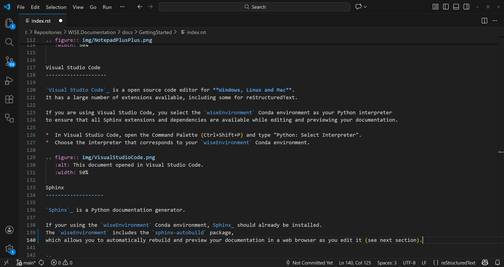

Getting started
*******************************************

This chapter covers three topics:

* How to set up and use the WISE environment.
* How to build and view the documentation locally, using Sphinx_.
* How to publish the documentation online using GitHub_ Pages and GitHub Actions.

It also works as a quick reference in case you don't remember a step in the process.

   .. warning::

      If you are an end user (a.k.a. a *"thematic"*) this is not the page you're looking for :-) 

      This documentation is intended for developers and contributors 
      who are responsible for creating and maintaining the documentation for WISE dataflows and projects.

.. contents:: On this page...
   :depth: 2
   :local:

Setting up the environment
==============================

*  Make sure you have Anaconda_ available on your system.  

   This project uses Conda_ to manage its dependencies and ensure a reproducible workflow.   

   All required packages for data analysis and documentation are specified in the `environment.yml` file 
   that you can download :download:`here <src/environment.yml>`.

*  Open the Anaconda PowerShell (Windows) or your terminal of choice (Linux/Mac).  

   Navigate to the root directory of the project where the `environment.yml` file was copied to:

   .. code-block:: bash

      cd path/to/your/project

*  Run the following command to build the environment. This will download and install all the exact package versions required for the project:

   .. code-block:: bash

      conda env create -f environment.yml

*  This process may take a few minutes, depending on your internet connection and the number of packages being installed.  
   Conda will handle all dependencies and ensure that the environment is set up correctly.

   Once the installation finishes, you need to activate the environment before running any scripts:

   .. code-block:: bash

      conda activate wiseEnvironment

*  You should now see `(wiseEnvironment)` at the beginning of your terminal prompt.

Updating the environment
------------------------

*  If the project's dependencies change and the `environment.yml` file is updated, 
   you can refresh your local setup without recreating it from scratch by running:

   .. code-block:: bash

      conda env update -f environment.yml --prune

Writing documentation
================================== 

*  We use Sphinx_ for documentation: it allows us to write in reStructuredText_ (reST) format, which is a simple and powerful markup language.  
   You can also write in Markdown_ format using MyST_ parser, which is compatible with Sphinx.

   Files with the `.rst` extension are processed as reST, while files with the `.md` extension are processed as Markdown.
   You can choose the format that best suits your needs and preferences.

   If you are a developer working on WISE documentation, you can use `sphinx-autodoc2` for automatic docstring generation.

*  All you need is `Notepad++`_ or any text editor of your choice to create and edit the documentation files. 

*  You can also use `Visual Studio Code`_ for a more feature-rich experience.

*  You you already have documentation in other formats, you may convert it using Pandoc_.

Pandoc
-----------------

`Pandoc`_ is a free and open-source document converter, available for **Windows, Linux and Mac**.

It can convert files in formats such as HTML, PDF, DOCX, ODT, etc. 
to and from reStructuredText_ and Markdown_ (including the CommonMark_ flavour supported by Sphinx_ and GitHub_). 

You can use it to convert existing documents to `*.rst` or `*.md` format,
before editing them with a text or code editor (e.g. Notepad++, Visual Studio Code).

Notepad++
------------------

`Notepad++`_ is a free source code editor and Notepad replacement that supports several programming languages.  
It is only available for **Windows**.

reStructuredText and Markdown are not among the languages natively recognised by Notepad++,
but can be added using a `Notepad++ User Defined Language File`_
(see install instructions below the list of available language files).

* Follow the link to download the `Notepad++ ReST syntax file`_.
* Follow the link to download the `Notepad++ Markdown syntax file`_.

.. figure:: img/NotepadPlusPlus.png
   :alt: This document opened in Notepad++.
   :width: 50%

Visual Studio Code
-------------------- 

`Visual Studio Code`_ is a open source code editor for **Windows, Linux and Mac**.  
It has a large number of extensions available, including some for reStructuredText.

If you are using Visual Studio Code, you select the `wiseEnvironment` Conda environment as your Python interpreter 
to ensure that all Sphinx extensions and dependencies are available while editing and previewing your documentation.

*  In Visual Studio Code, open the Command Palette (Ctrl+Shift+P) and type "Python: Select Interpreter".
*  Choose the interpreter that corresponds to your `wiseEnvironment` Conda environment.

Sphinx
-------------------

`Sphinx`_ is a Python documentation generator.

If your using the `wiseEnvironment` Conda environment, Sphinx_ should already be installed.
The `wiseEnvironment` includes the `sphinx-autobuild` package, 
which allows you to automatically rebuild and preview your documentation in a web browser as you edit it (see next section).

..
   The Sphinx builder can produce a number of output formats (e.g. HTML, PDF).
   PDF files can be produced using the LaTeX builder (more complicated)
   or using the direct PDF builder called rst2pdf (see below).
..

Building documentation
================================== 

Before building the documentation, ensure your Conda environment is activated:

.. code-block:: bash

   conda activate wiseEnvironment

"Live build" (Recommended for Development)
----------------------------------------------------

If you are actively writing or editing documentation, the best way to preview your changes is using `sphinx-autobuild`. 
This will start a local web server and automatically refresh your browser whenever you save a file.

*  **Start the autobuild server.**  

   Navigate to the root of your project and run:

   .. code-block:: bash

      sphinx-autobuild docs docs/_build/html

   *(Note: If your Sphinx source files are in a different directory than `**docs**`, adjust the paths accordingly).*

*  **View the docs:**  

   Open your web browser and navigate to the local URL provided in the terminal (usually `http://127.0.0.1:8000`).

Standard HTML Build
-----------------------------

If you just want to generate the static HTML files once without starting a persistent server, you can use the standard build command.

*  **Build the HTML files:**  

   Navigate to your documentation directory (usually `docs/`) and run:

   .. code-block:: bash

      make html

   *(On Windows, use `.\make.bat html` instead).*

*  **View the docs**  

   Open the generated `index.html` file in your browser. You can typically find it at:

   .. code-block:: 
      
      docs/_build/html/index.html

Publishing to GitHub Pages
==========================

Once your documentation is ready to be shared, you can automatically publish it using GitHub Pages. 
The best way to do this is by setting up a GitHub Actions workflow 
that automatically builds and deploys your HTML files whenever you push changes to your main branch.

*  **Create a GitHub Actions workflow**  

   Create a new configuration file in your repository at `.github/workflows/documentation.yml`.  
   Use the configuration in the `documentation.yml` file 
   that you can download :download:`here <src/documentation.yml>`.

*  **Configure your repository settings**  

   Once the action runs for the first time, it will create a new branch called `gh-pages`.

   *  Go to your repository on GitHub.
   *  Navigate to **Settings** > **Pages**.
   *  Under **Build and deployment**, set the **Source** to "Deploy from a branch".
   *  Select the `gh-pages` branch and the `/ (root)` folder, then click **Save**.

Your documentation will now be publicly accessible at `https://<your-username>.github.io/<your-repository-name>/`.

   .. warning::

      Before publishing your documentation, make sure to review it locally and ensure that it is accurate and up-to-date. 
      Once published, the documentation will be publicly accessible, so it's important to verify its quality beforehand.

      Make sure that your WISE project manager is aware of the publication and has approved the content,
      specially is it is being published in an organisational repository.

.. links-placeholder

.. include:: ../_sharedFiles/Links.rst
      