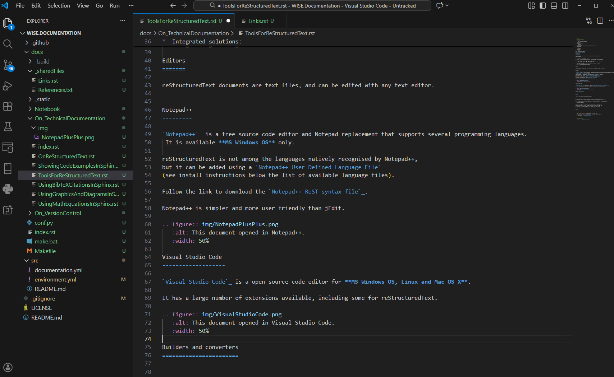

:tocdepth: 2

.. metadata-placeholder

   :DC.Title:
      Tools for reStructuredText
   :DC.Creator:
      Nery, Fernanda
   :DC.Date:
      2013-09-01
   :DC.Description:
      Some tools to work with reStructuredText documents.
   :DC.Language:
      en
   :DC.Format:
      text/x-rst
   :DC.Rights:
      Public.

Which tools should you use?
***************************

The only thing you really need is a text editor or a browser... 
but there are some tools that can make your life easier when working with reStructuredText or Markdown documents.

Pandoc
=====================

`Pandoc`_ is a free and open-source document converter, available for **Windows, Linux and Mac**.

It can convert files in formats such as HTML, PDF, DOCX, ODT, etc. 
to and from reStructuredText_ and Markdown_ (including the CommonMark_ flavour supported by Sphinx_ and GitHub_). 

You can use it to convert existing documents to `*.rst` or `*.md` format,
before eiting them with a text or code editor (e.g. Notepad++, Visual Studio Code).

Notepad++
============

`Notepad++`_ is a free source code editor and Notepad replacement that supports several programming languages.  
It is only available for **Windows**.

reStructuredText is not among the languages natively recognised by Notepad++,
but it can be added using a `Notepad++ User Defined Language File`_
(see install instructions below the list of available language files).

Follow the link to download the `Notepad++ ReST syntax file`_.

.. figure:: img/NotepadPlusPlus.png
   :alt: This document opened in Notepad++.
   :width: 50%

Visual Studio Code
===================   

`Visual Studio Code`_ is a open source code editor for **Windows, Linux and Mac**.  
It has a large number of extensions available, including some for reStructuredText.

Sphinx
====================

`Sphinx`_ is a Python documentation generator.

It requires `Python`_, which is installed by default in **Linux and Mac** systems.
For **Windows** systems, see https://www.python.org/downloads/windows/.

After you have Python installed, simply use the following command (in a command window)::

   pip install -U sphinx

Elevated privileges (i.e. administration rights) should not be required.

The Sphinx builder can produce a number of output formats (e.g. HTML, PDF).
PDF files can be produced using the LaTeX builder (more complicated)
or using the direct PDF builder called rst2pdf (see below).

.. links-placeholder

.. include:: ../_sharedFiles/Links.rst